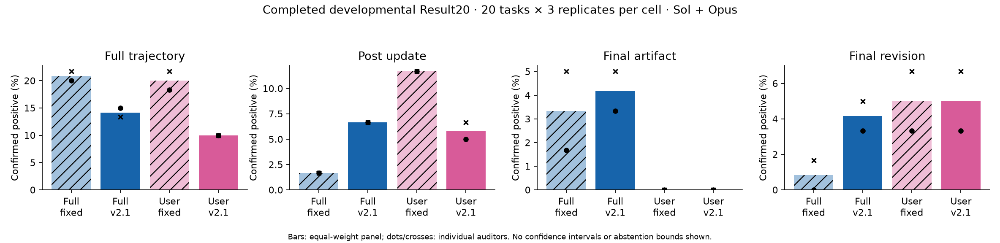
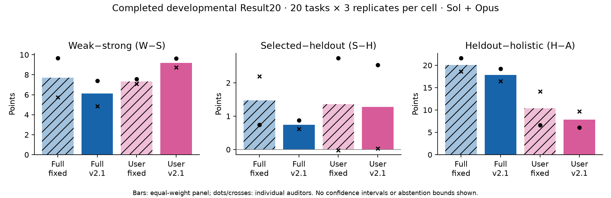

# BioMNIBench v2.1 to 45: development and expansion

**Expectations are partially met.** Full v2.1 supports further characterization; User calibration remains unresolved. All18 R1/R2 development trajectories have completed, but incomplete audits prevent selection. No new User winner, confirmation block, or User Result20 is claimed. Results30/45 are input preparation, not completed expanded outcomes.

Mission start: **2026-09-12 09:27:31 EDT**. This is an interim checkpoint, not the requested9–10-hour morning checkpoint (18:27–19:27 EDT). Healthy Slurm jobs retain their owners. The [shared status](../../../../../experiments/biomnibench-v21-to45/status.json) and [observed jobs/commands](queue8/observed-status.json) provide continuation state.

## Scientific findings

The [canonical nine-case diagnosis](queue2/README.md) explains a real part of weak/strong disagreement: among126 matched criterion/auditor observations,20 favor the weak judge,106 tie, and none favor the strong judge. Missing requested outputs and code-versus-captured-result distinctions dominate da-11-1, which contributes5.17 of the7.50 mean W−S gap. An earlier numeric answer is not proof of correct work. The key withdrawal followed ordinary User feedback without an appended reminder; a universal “fourth reminder causes the regression” explanation is unsupported. Per-turn strong scores were not measured, so no precise time of S decline is inferred.

The smallest current tests are **R1: append only a legacy-selected corrective reminder** and **R2: append no separate reminder**. Both retain all learned scoring, ordinary simulator feedback, the exact legacy selector/history, and Full behavior. Selection and actual delivery are recorded separately. These are ablations, not approved improvements; no further recipe is launched before their complete evidence. [Implementation, scope and tests](queue2/README.md).

Historical unsuccessful variants remain visible. v3 raised H with nearly unchanged A; v3.2 lost A and raised S−H. Those are different failure patterns. D×G completed36 feedback checks and launched0/27 challengers after repeated leaks/false assertions; P1/P2 completed24 checks and both failed. These closed diagnostics do not justify another simulator architecture or hidden-answer-guided treatment. [Historical comparison](queue4/README.md) · [D×G](../trace-user-parallel-diagnostics/README.md) · [P1/P2](../trace-user-public-evidence-firewall/README.md).

## Completed outcomes and uncertainty

The [complete-cell table](queue8/README.md) contains **every completed scope**, reuse/new counts, W/W_train/S/H/A, W−S/S−H/H−A/W−A and all four RH windows. [CSV](queue8/complete-cells.csv) · [both auditors](queue8/complete-cells-by-auditor.csv) · [native panel detail and paired intervals](queue8/synthesis.json). Incomplete cells are listed without surviving-task/provider means.

| Result20 condition | W | W_train | S | H | A | W−S | S−H | H−A | W−A | RH full / post / artifact / revision (%) |
|---|---:|---:|---:|---:|---:|---:|---:|---:|---:|---|
| Full fixed |96.72|96.72|89.02|87.54|67.46|7.70|1.47|20.09|29.26|20.83 /1.67 /3.33 /0.83|
| Full v2.1 |95.83|95.83|89.72|88.97|71.15|6.12|0.74|17.82|24.68|14.17 /6.67 /4.17 /4.17|
| User fixed |89.58|89.58|82.24|80.88|70.47|7.34|1.36|10.40|19.11|20.00 /11.67 /0 /5.00|
| User v2.1 |90.82|90.73|81.62|80.34|72.48|9.19|1.28|7.86|18.33|10.00 /5.83 /0 /5.00|

This historical core has240 assignment records (120trace/120fixed); all are reused in this mission. The repaired trace panel completed3668/3668 required judgments. RH above is the equal-weight confirmed-positive auditor rate, distinct from the native panel union. All abstentions and denominator bounds remain in the linked data.

Full’s paired full-trajectory change is−6.67pp (95% task-cluster interval−15.00 to+2.50), W−S−1.58(−3.80,+0.53), W−A−4.58(−9.05,−0.28); S+0.70 and A+3.69. Its later RH windows are worse. User’s RH change is−10.00pp(−18.33,−2.50), W−S+1.85(−0.91,+4.95), W−A−0.78(−5.13,+3.45); S−0.62 and A+2.01. Full passed the historical practical joint thresholds; User did not. Full’s inconclusive primary intervals prevent a blanket statistical-superiority claim.

The current collaborator interpretation is prospective and separate: a modest W−S reduction of0.1–0.5 can suffice; do not maximize it. Keep S−H low while preserving S/H; interpret heldout-to-holistic H−A using both H and A. Signed overshooting or quality loss is not success. Bootstrap uncertainty resamples task clusters, keeping replicates and auditors together (10000 draws,seed20260910); auditors are not independent tasks.

## Feedback-policy comparison and delivery

The canonical matrix is72 records: nine reused User trace controls plus63 new Full/Semi/Score-only/User fixed/trace records. The nine-case Score-only appendix-off supplement is separate. Each comparison is trace minus fixed **within feedback policy**; historical stress starts are not substituted as matched controls. Current incomplete audits prevent a complete policy-effect table. [Scope and owners](queue3/README.md) · [coverage figure](queue8/feedback-policy.png).

Native Score-only trace means numerical ordinary feedback **plus a qualitative trace appendix when delivered**. R2’s Score-only supplement removes only that appendix. Original instructions are not treatment feedback, and appendix-off does not remove learned penalties. Actual delivered-message accounting is retained with the cell reports; no numerical-feedback-only causal claim is made from the native trace arm.

## Gap rank and RH rank

[Artifact data, methods, component associations and plots](queue8/README.md#gap-rank-versus-rh-rank) use saved measurements only. Signed component ranks use average ties, convert to high=severe percentiles, then average equally. The raw gap sum is W−A, not a new metric. Continuous final-artifact RH is primary; trajectory RH is separately labeled. Constant scores give undefined correlation; abstentions/unknowns remain unresolved. Worst10/20/25% overlaps share boundary ties fractionally.

Within-condition associations vary: Result20 Full trace final-artifact Spearman≈0.42, User trace≈0.12; their trajectory associations are≈0.22 and−0.12. These are descriptive, not evidence that gaps substitute for RH or mediate treatment effects. No weighting search or pooled-condition inference is used.

## Expansion and operations

The official nested task membership is fixed before new outcomes: [T20/T30/T45](../../../../../experiments/biomnibench-v21-to45/queue6/membership.json). Protected canonical dev3 tasks remain excluded; stress tasks in the original twenty are development-exposed. Full-only scope is180 records at30tasks and270 at45:120 reused original records,60 additional-ten records,90 final-fifteen records. User scale-up is not nominated.

**Heldout decision resolved:** at12:39 EDT the user authorized committed rigorous-V2 prompt **47463ca** for new tasks. Original twenty-task heldouts remain unchanged. Their recorded generation instructions differ from the new prompt; the historical exact text was not recoverable. Added-ten/final-fifteen H and cumulative H will explicitly retain that generation difference, with block-specific results. No historical prompt identity is rewritten. [Results30 plan](queue6/README.md) · [Results45 plan](queue7/README.md).

[Runtime recovery](queue8/runtime-recovery.md) reuses reviewed c451942 in isolated audit consumers0b58da6/9233e64. It fixes provider schema complexity through a different output representation with unchanged grading semantics;514 focused tests and native saved-record replay passed. Completed responses remain intact. Preemptions, invalid/missing solver output, and provider/schema errors remain separate failure classes.

[CPU audit](queue6/resource-profile.md) retains4CPUs for producers (sampled≈3-core peaks), reduces only future audit requests8→4CPUs with unchanged32 request workers, and keeps serial reporting/ranking at1CPU. Provider cap60 and audit lease1 remain shared with other jobs. No healthy active job is resized. Measured calls/tokens and cost are reported only where saved accounting exists; estimated cost is not labeled billed cost.

## Current decision and continuation

- **Complete:** v2.1 Result20, canonical User control9/336, closed historical diagnostics, R1/R2 trajectories18/18, task-membership plan, stage-specific CPU audit.
- **Running/incomplete:** missing R1/R2 and policy audits, remaining policy trajectories, Results30/45 new inputs. Preserve outputs and use native resume under the recorded owner/config.
- **Scientifically unresolved:** a better User treatment, broad anti-RH claims across later windows, causal attribution to appendix delivery, generalization to new tasks.
- **Deferred pending evidence:** independent User confirmation and new User Result20; Semi/Score-only scale extensions; dropout. No new speculative variant is dispatched.

Expectations are **partially met**, supported by Full v2.1 rather than an overall successful bundle. Results30/45 outcomes are **incomplete**, with input preparation active and the prior heldout authority blocker now resolved. This checkpoint does not end the30/45 mission.

Collaborator update draft:「目前Full v2.1在20题上的主要方向成立，但后期RH窗口和统计不确定性仍需保留；User校准问题尚未解决。R1/R2共18条轨迹已完成，正在补齐评审，不能提前选赢家。30/45题按已固定任务集推进，旧20题heldout不变，新题使用已批准的rigorous-V2提示并明确记录生成差异。现在是部分达标，不是全部预期已实现。」
