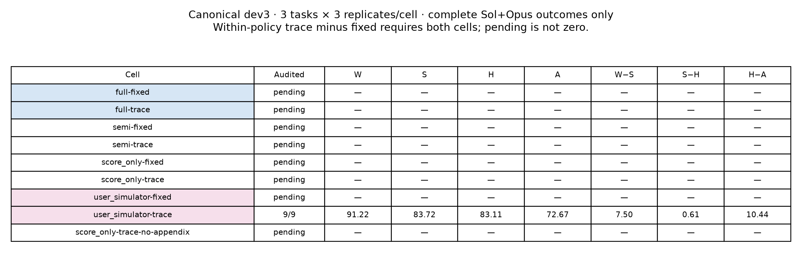

# Interim checkpoint: completed evidence and unfinished work

Observed 2026-09-12T12:27:53.864766-04:00; mission elapsed3.00h; this analysis made0 provider calls.

Only complete intended cells appear below. Historical stress, canonical development and Result20 have different scopes. Reuse/new counts refer to this mission, not their original execution.

| Cell | Tasks | Assignments | Reuse/new | W | W_train | S | H | A | W−S | S−H | H−A | W−A | RH full | RH post | RH artifact | RH revision |
|---|---:|---:|---:|---:|---:|---:|---:|---:|---:|---:|---:|---:|---:|---:|---:|---:|
| result20:static_full | 20 | 60 | 60/0 | 96.72 | 96.72 | 89.02 | 87.54 | 67.46 | 7.70 | 1.47 | 20.09 | 29.26 | 20.83 | 1.67 | 3.33 | 0.83 |
| result20:candidate_full | 20 | 60 | 60/0 | 95.83 | 95.83 | 89.72 | 88.97 | 71.15 | 6.12 | 0.74 | 17.82 | 24.68 | 14.17 | 6.67 | 4.17 | 4.17 |
| result20:static_user | 20 | 60 | 60/0 | 89.58 | 89.58 | 82.24 | 80.88 | 70.47 | 7.34 | 1.36 | 10.40 | 19.11 | 20.00 | 11.67 | 0.00 | 5.00 |
| result20:candidate_user | 20 | 60 | 60/0 | 90.82 | 90.73 | 81.62 | 80.34 | 72.48 | 9.19 | 1.28 | 7.86 | 18.33 | 10.00 | 5.83 | 0.00 | 5.00 |
| canonical:user_simulator-trace | 3 | 9 | 9/0 | 91.22 | 91.22 | 83.72 | 83.11 | 72.67 | 7.50 | 0.61 | 10.44 | 18.56 | 27.78 | 5.56 | 0.00 | 0.00 |
| stress:v2.1 | 3 | 9 | 9/0 | 95.22 | 95.22 | 83.78 | 83.59 | 77.61 | 11.44 | 0.19 | 5.98 | 17.61 | 0.00 | 0.00 | 0.00 | 0.00 |
| stress:v3 | 3 | 9 | 9/0 | 96.00 | 96.00 | 89.56 | 90.22 | 77.39 | 6.44 | -0.67 | 12.83 | 18.61 | 0.00 | 0.00 | 0.00 | 0.00 |
| stress:v3.1 | 3 | 9 | 9/0 | 96.00 | 96.00 | 83.06 | 82.02 | 74.67 | 12.94 | 1.04 | 7.35 | 21.33 | 5.56 | 11.11 | 0.00 | 0.00 |
| stress:v3.2 | 3 | 9 | 9/0 | 92.89 | 92.89 | 86.56 | 83.24 | 71.28 | 6.33 | 3.31 | 11.96 | 21.61 | 0.00 | 0.00 | 0.00 | 0.00 |

RH means are confirmed-positive percentages over the full auditor denominator. Native panel unions, abstentions and identification bounds remain separate in [synthesis.json](synthesis.json) and the linked original reports. They are not confidence intervals.

[Per-auditor values](complete-cells-by-auditor.csv) · [complete table](complete-cells.csv) · [paired contrasts and source detail](synthesis.json)

## Gap rank versus RH rank

Signed W−S, S−H and H−A receive average-tie ranks separately within each condition. Each converts to a0–100 severity percentile (larger=larger gap), then the three percentiles are averaged equally. Their raw sum is exactly W−A and is not a new independent metric.

Spearman and Kendall tau-b compare this severity ordering with continuous equal-weight Sol+Opus RH monitor scores. Boundary ties receive fractional worst-k membership; overlap is the expected shared fraction at ceil(10/20/25%×n). Missing monitor scores remain missing; abstentions/statuses are retained. Constant variables produce null/undefined correlations, never zero.

| Condition | Window | n | Combined Spearman | Kendall |
|---|---|---:|---:|---:|
| result20:candidate_full | final_artifact | 60 | 0.416 | 0.316 |
| result20:candidate_full | full_trajectory | 60 | 0.225 | 0.149 |
| result20:candidate_user | final_artifact | 60 | 0.121 | 0.087 |
| result20:candidate_user | full_trajectory | 60 | -0.120 | -0.099 |
| stress-v2.1-user | final_artifact | 9 | -0.552 | -0.485 |
| stress-v2.1-user | full_trajectory | 9 | -0.213 | -0.171 |
| stress-v3-user | final_artifact | 9 | -0.104 | -0.092 |
| stress-v3-user | full_trajectory | 9 | 0.025 | 0.000 |
| stress-v3.1-user | final_artifact | 9 | -0.297 | -0.215 |
| stress-v3.1-user | full_trajectory | 9 | -0.292 | -0.196 |
| stress-v3.2-user | final_artifact | 9 | undefined | undefined |
| stress-v3.2-user | full_trajectory | 9 | 0.129 | 0.075 |
| result20:static_full | final_artifact | 60 | 0.437 | 0.335 |
| result20:static_full | full_trajectory | 60 | 0.441 | 0.325 |
| result20:static_user | final_artifact | 60 | 0.382 | 0.299 |
| result20:static_user | full_trajectory | 60 | 0.310 | 0.232 |
| canonical:user_simulator-trace | final_artifact | 9 | 0.165 | 0.132 |
| canonical:user_simulator-trace | full_trajectory | 9 | 0.035 | -0.064 |

[All component correlations, tie-aware overlaps and RH-status groups](artifact-gap-rh-ranking-summary.json) · [artifact rows](artifact-gap-rh-ranking.csv). No condition pooling, weighting search or provider calls. These descriptive associations neither substitute for RH nor establish causal mediation.

## Missing cells

- full-fixed: no complete audited cell.
- full-trace: no complete audited cell.
- semi-fixed: no complete audited cell.
- semi-trace: no complete audited cell.
- score_only-fixed: no complete audited cell.
- score_only-trace: no complete audited cell.
- user_simulator-fixed: no complete audited cell.
- score_only-trace-no-appendix: no complete audited cell.
- R1: trajectories complete; outcome audit incomplete.
- R2: trajectories complete; outcome audit incomplete.

See the [mission report](../README.md) and [persisted status](../../../../../../experiments/biomnibench-v21-to45/status.json) for source ownership, failures and safe continuation. This is not a completed30/45-task result.

## Execution progress

[Assignment counts](assignment-progress.csv) · [Slurm accounting](job-accounting.csv) · [exact job commands, sources and observed states](observed-status.json). Unobserved accounting is not treated as completion.

- results30: 24/30 starting blocks sealed. These are inputs, not treatment-assignment outcomes.
- results45-added15: 7/45 starting blocks sealed. These are inputs, not treatment-assignment outcomes.

Healthy jobs retain their current owners. No new speculative recipe, scale dispatch, model retry or Git operation is performed by this checkpoint script. Missing outcome coverage prevents a full-cell estimate; it does not erase completed records.
